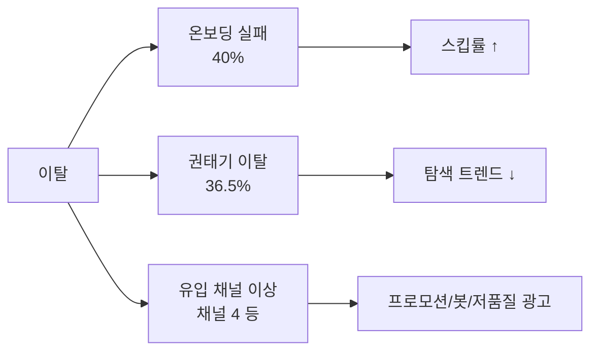

# KKBox 이탈 분석 종합 보고서

> **데이터**: `df_track1_final_master.parquet` (21,547,746행 / 2,363,626 유저)  
> **분석 노트북**: `tobigs.ipynb` (코호트 · 퍼널 · 패스 · 생존 4대 분석)  
> **작성 목적**: EDA 결과를 비즈니스 언어로 종합하고, ML·NLP 후속 과제의 근거를 정리

---

## 1. Executive Summary

KKBox 구독 이탈은 **단일 현상이 아니라 두 가지 유형**으로 나뉜다.

| 이탈 유형 | 규모 | 핵심 신호 | 모델 대응 | 개입 시점 |
|-----------|------|-----------|----------|-----------|
| **온보딩 실패** (초기 이탈) | 전체의 **40.1%** (948,039명) | 스킵률 ↑ | 모델 A (Random Forest) | 가입 후 2주 이내 |
| **권태기 이탈** (충성 고객 이탈) | 안정권의 **36.5%** (516,457명) | 탐색 트렌드 ↓ | 모델 B (Random Forest) | 이탈 1~2개월 전 |
| **채널 이상** (유입 품질 문제) | 채널 4 **89.9%** 이탈율 | 채널 4 플래그 | 규칙 기반 (모델 피처 + 점수 부스트) | 가입 시점 |

**핵심 결론**: 
- 4대 EDA 분석에서 검증된 신호(스킵률, 탐색 트렌드, 채널)를 **RandomForest 모델의 입력 피처**로 활용
- 모델과 비즈니스 규칙을 결합하여 **0~100점 리스크 스코어** 산출
- **이탈 유형별 모델 분리 + 단계별 개입**으로 ROI 극대화

---

## 2. 분석 ① 코호트 분석 — "언제, 얼마나 빠지는가?"

### 2.1 마의 3개월 락인 효과 (★★★ 강함)

- M+1 평균 잔존율: **57.3%**
- M+3 평균 잔존율: **45.8%**
- M+1→M+3 평균 감소폭: **10.4%p** (이후 구간은 변동폭 2~5%로 안정화)

**해석**: 가입 후 3개월이 **제품 적응 구간**이며, 이 구간을 넘기면 습관화되어 이탈 속도가 느려진다.  
→ **온보딩 개선이 회사 매출에 가장 큰 레버**다.

### 2.2 비정상 코호트 (Z-score 이상치)

| 코호트 | M+1 잔존율 | Z-score | 의미 |
|--------|-----------|---------|------|
| **2015-06** | 12.3% | -2.21 | 서비스 초기 / 채널 혼재 / 기술 불안정 추정 |
| 2016-10 | 37.7% | -0.88 | 재앙 코호트 (생존 분석에서 추가 검증) |

### 2.3 M+1→M+2 급락 코호트

- 평균 감소폭 대비 큰 코호트: **2016-04** (M+1 66.1% → M+2 42.5%, **-23.6%p**)
- **"1개월 안에 이탈을 결정한 유저"** 비율이 높음 → 초기 경험(추천·검색) 문제 가능성

---

## 3. 분석 ② 퍼널 분석 — "어느 구간에서 새는가?"

```
Stage 1: 결제 1회 완료        2,363,626명 (100%)
    ↓ 59.9% 전환
Stage 2: 3개월 연속 결제      1,415,587명
    ↓ 36.5% 전환
Stage 3: 안정 후 첫 취소        516,457명
```

| 구간 | 이탈/전환 실패 | 비율 | 비즈니스 의미 |
|------|----------------|------|---------------|
| Stage 1→2 | 948,039명 | **40.1%** | 온보딩 실패 — 매출의 최대 누수구 |
| Stage 2→3 | 899,130명 | **36.5%** | 권태기 이탈 — 이미 정착한 고객의 이탈 |

- 두 구간 모두 통계적으로 유의 (이항검정 p < 0.001)
- **초기 40%가 조금 더 심각**하지만, 권태기는 **회복 가능성이 높음** (이미 습관화된 고객)

---

## 4. 분석 ③ 패스 분석 — "왜 빠지는가?" (행동 신호)

### 4.1 온보딩 실패 그룹 (tx_order = 1)

| 지표 | 잔존 유저 | 이탈 유저 | 차이 |
|------|-----------|-----------|------|
| 스킵률 (평균) | 0.217 | 0.255 | **+17.5%** |
| 표본 | 1,626,358명 | 737,268명 | — |

- Mann-Whitney U: **p < 0.001**
- Cohen's d: **0.20** (작지만 실무적 의미 있음)
- **실무 룰**: 스킵률 > 30% → 초기 이탈 고위험군

**해석**: 이탈 신규 유저는 "곡을 찾지 못해" 스킵을 반복하다 이탈한다. 추천·검색·온보딩 UI 개선이 직접적 대응책이다.

### 4.2 권태기 이탈 그룹 (tx_order ≥ 3)

| 지표 | 잔존 유저 | 이탈 유저 | 차이 |
|------|-----------|-----------|------|
| 탐색 트렌드 (7일/30일) | 0.989 | 0.950 | **-4.0%** |
| 표본 | 16,550,459행 | 862,136행 | — |

- Mann-Whitney U: **p < 0.001**
- Cohen's d: **-0.09** (통계적 유의, 효과 크기는 작음)
- **실무 룰**: 탐색 트렌드 < 0.8 → 권태기 고위험군 조기 경보

**해석**: 충성 고객 이탈 전 탐색 활동이 감소한다. 콘텐츠 피로·경쟁사 환승·신곡 부족 등이 복합 원인일 수 있으며, 인과 방향은 A/B 테스트로 검증 필요.

---

## 5. 분석 ④ 생존 분석 — "누가, 얼마나 빨리 죽는가?"

### 5.1 정상 vs 재앙 코호트 (2016-01 vs 2016-10)

| 지표 | 정상 (2016-01) | 재앙 (2016-10) |
|------|----------------|----------------|
| 유저 수 | 62,669명 | 82,236명 |
| 이탈 사건 | 13,618명 | 58,958명 |
| 90일 생존율 | **94.87%** | **82.62%** |
| Logrank p-value | **< 0.001** | — |

### 5.2 재앙 코호트 내 채널별 이탈율

| 채널 | 유저 수 | 이탈율 | 조치 |
|------|---------|--------|------|
| 채널 7 | 11,646명 | 4.6% | 유지 |
| 채널 3 | 14,115명 | 75.6% | 즉시 점검 |
| **채널 4** | **45,835명** | **89.9%** | **자동 고위험군 플래깅 / 마케팅 중단 검토** |

채널 간 Logrank 검정: **p < 0.05** (극도로 명확한 차이)

---

## 6. 통합 인사이트 — "So What?"

### 6.1 이탈의 3가지 원인 축



### 6.2 개입 전략 매트릭스

| 신호 | 대상 | 개입 액션 | 우선순위 |
|------|------|-----------|----------|
| 스킵률 > 30% | 신규 (tx 1~2) | 추천 재생성, 튜토리얼, 취향 온보딩 | ⭐⭐⭐ |
| 탐색 트렌드 < 0.8 | 충성 (tx ≥ 3) | 신곡 폭주 추천, 플레이리스트 신규 | ⭐⭐⭐ |
| 채널 4 유입 | 전 구간 | 자동 고위험군, 마케팅 ROI 재검토 | ⭐⭐⭐ |
| 2016-10 유사 코호트 | 코호트 단위 | 마케팅 정책·시스템 로그 점검 | ⭐⭐ |

### 6.3 통계적 한계 (보고서에 반드시 명시)

1. **p < 0.001 ≠ 인과관계** — 대규모 표본에서는 작은 차이도 유의해짐
2. **Cohen's d < 0.2** — 패스 분석 신호는 방향은 맞지만 단독 예측력은 제한적 → **복합 모델 필요**
3. **탐색 감소 vs 이탈 결정** — 시간 순서(인과)는 NLP·A/B로 보완 필요

---

## 7. 후속 과제 (Track 1 & 2)

### Track 1: ML 이탈 예측 (`churn_ml_models.ipynb`)

#### 7.1 모델 구조

| 단계 | 모델 | 대상 | 모델 입력 피처 | 스코어링 로직 |
|------|------|------|----------------|------------|
| **단계 1: 모델 학습** | **모델 A** (온보딩) | tx_order = 1 | `avg_skip_rate`, `trend_unq_7d_vs_30d`, `avg_complete_rate`, `std_num_unq_last_30d`, `channel_4_flag`, `tenure_at_tx`, `is_discounted`, `cum_cancel_count`, `is_method_changed`, `has_logs`, `gender_M` (총 11개) | RandomForest 자동 학습 |
| | **모델 B** (권태기) | tx_order ≥ 3 | 동일 (11개) | RandomForest 자동 학습 |
| **단계 2: 리스크 점수 계산** | **스코어링** (A & B 공통) | 전체 사용자 | 원본 데이터 + 파생 변수 | ML 점수 × 0.6 + 규칙 부스트 × 0.4 |

#### 7.2 상세 구성 요소

**① 모델 입력 변수 (FEATURE_COLS - 11개)**

| 변수 | 출처 | 설명 | 비고 |
|------|------|------|------|
| `avg_skip_rate` | 원본 | 평균 스킵률 | 행동 신호 |
| `trend_unq_7d_vs_30d` | 원본 | 탐색 트렌드 (7일/30일 비율) | 행동 신호 |
| `avg_complete_rate` | 원본 | 평균 완성률 | 행동 신호 |
| `std_num_unq_last_30d` | 원본 | 곡 다양성 (표준편차) | 행동 신호 |
| **`channel_4_flag`** | **파생** | `registered_via == 4` (채널 4 플래그) | ⚠️ 모델이 자동 가중치 학습 |
| `tenure_at_tx` | 원본 | 가입부터 결제까지 기간 | 사용 기간 |
| `is_discounted` | 원본 | 할인 여부 | 결제 특성 |
| `cum_cancel_count` | 원본 | 누적 취소 횟수 | 행동 신호 |
| `is_method_changed` | 원본 | 결제 수단 변경 여부 | 행동 신호 |
| **`has_logs`** | **파생** | `avg_skip_rate.notna()` (행동 데이터 존재 여부) | 결측값 핸들링 |
| **`gender_M`** | **파생** | `gender == 'male'` | 인구통계 |

**② 스코어링 규칙 부스트 (+0~60점)**

```python
risk_score = ml_score * 0.6 + rule_boost
# ml_score: 모델의 예측 확률 (0~100)
# rule_boost: 비즈니스 규칙 기반 추가 점수 (0~60)

rule_boost 계산:
├─ if registered_via == 4:       +40점 ⚠️ (채널 4)
├─ if avg_skip_rate > 0.30:      +20점 (높은 스킵률)
└─ if trend_unq_7d_vs_30d < 0.80: +20점 (낮은 탐색)
```

#### 7.3 ⚠️ 중요: 채널 4 처리 방식 (이중 효과)

| 처리 단계 | 방식 | 효과 |
|---------|------|------|
| **모델 학습** | `channel_4_flag` ✅ FEATURE_COLS에 포함 | RandomForest가 자동으로 채널 4의 가중치 학습 → 피처 중요도에 반영 |
| **스코어링** | `if registered_via == 4: +40` ✅ 규칙 부스트 | 채널 4 사용자에게 추가 점수 부스트 |
| **결과** | 이중 효과 | 채널 4 사용자 = 모델이 학습한 페널티 + 규칙 부스트 추가 |

**해석**: 채널 4는 **모델 자체에서 검출**되며, 추가로 **비즈니스 규칙으로 강화**됨.

#### 7.4 메타데이터 (분석용 - 모델 학습에 미사용)

| 변수 | 정의 | 용도 | 비고 |
|------|------|------|------|
| `high_skip_flag` | `avg_skip_rate > 0.30` | 분석/시각화 | FEATURE_COLS 미포함 (모델은 원본 `avg_skip_rate` 사용) |
| `low_explore_flag` | `trend_unq_7d_vs_30d < 0.80` | 분석/시각화 | FEATURE_COLS 미포함 (모델은 원본 `trend_unq_7d_vs_30d` 사용) |
| `auto_high_risk` | `= channel_4_flag` | 추적용 | 현재 활용도 낮음, 채널 4 검출용 |

---

### Track 2: NLP 리뷰 분석 (`churn_nlp_reviews.ipynb`)

| 그룹 | 검증 키워드 | EDA 가설 |
|------|-------------|----------|
| 초기 이탈자 리뷰 | "추천 안 됨", "곡 없음" | 스킵률↑ = 추천/검색 실패 |
| 권태기 이탈자 리뷰 | "신곡 없음", "경쟁사" | 탐색↓ = 콘텐츠 피로·환승 |

---

## 8. 운영 적용 (Step-by-Step)

### 8.1 Step 0: 모델 및 규칙 검증 (현황)

**현재 모델 상태:**
- ✅ 온보딩 모델 (모델 A): 스킵률 기반 학습 완료
- ✅ 권태기 모델 (모델 B): 탐색 트렌드 기반 학습 완료
- ✅ 채널 4 규칙: 모델 피처 + 점수 부스트 이중 적용

### 8.2 Step 1: 고위험군 식별 (즉시, 1주)

| 대상 그룹 | 식별 기준 | 발동 기준 | 규모 추정 |
|---------|---------|---------|---------|
| **온보딩 고위험** | tx_order = 1 | risk_score ≥ 70점 | 약 30~40% |
| **권태기 고위험** | tx_order ≥ 3 | risk_score ≥ 70점 | 약 20~30% |
| **채널 4 사용자** | registered_via = 4 | 자동 태깅 (모든 tx_order) | 약 11~12% |

**액션:**
```
# 온보딩 고위험군
→ 추천 알고리즘 재생성 (top 5 곡 재탐색)
→ 튜토리얼 푸시 (곡 찾기 팁)
→ 선호도 재설정 요청

# 권태기 고위험군
→ 신곡 피폭 캠페인 (신규 곡 최우선 추천)
→ 플레이리스트 추천 강화
→ 컨텐츠 발견 경험 개선

# 채널 4 전체
→ 별도 온보딩 트랙 할당 (맞춤 튜토리얼)
→ 초기 추천 품질 강화
```

### 8.3 Step 2: 개입 효과 측정 (2~4주)

**A/B 테스트 설계:**

| 테스트 | 대조군 | 실험군 | KPI | 기대 효과 |
|-------|-------|-------|-----|---------|
| 온보딩 개입 | 기존 추천 | 고위험군 집중 추천 | 30일 잔존율 | +3~5%p |
| 권태기 개입 | 기존 추천 | 신곡 폭주 + 플리 강화 | 30일 잔존율 | +2~4%p |
| 채널 4 보정 | 기존 프로세스 | 별도 온보딩 트랙 | 90일 잔존율 | +10~15%p |

**주의:** 정확도(AUC)가 아닌 **이탈률 감소**를 KPI로 설정

### 8.4 Step 3: 정성 검증 (2~4주 병행)

**NLP 분석 (Track 2):**
- 온보딩 이탈자 리뷰 수집 → "추천 부족", "곡 없음" 키워드 빈도
- 권태기 이탈자 리뷰 수집 → "신곡 없음", "경쟁사" 키워드 빈도
- **목표:** 정량 모델의 신호와 정성 피드백의 일치도 검증

### 8.5 Step 4: 프로덕션 롤아웃 (1개월 후)

**사전 체크리스트:**
1. ✅ 온보딩 개입 테스트 → 유의미한 개선 확인
2. ✅ 권태기 개입 테스트 → 유의미한 개선 확인
3. ✅ 채널 4 개입 테스트 → 유의미한 개선 확인
4. ✅ NLP 검증 → 주요 키워드 일치도 > 70%

**롤아웃 순서:**
- Phase 1: 온보딩 모델 배포 (우선순위 ⭐⭐⭐)
- Phase 2: 권태기 모델 배포 (우선순위 ⭐⭐⭐)
- Phase 3: 채널 4 규칙 강화 (우선순위 ⭐⭐)

### 8.6 Step 5: 지속 모니터링 (월간)

**자동화 대시보드:**
1. **코호트 이상치 탐지** (Z-score) → 2016-10급 이벤트 조기 경보
2. **모델 드리프트 감시** → AUC, 피처 중요도 변화 추적
3. **개입 효과 추적** → 고위험군 이탈률 vs 기저 이탈률 비교
4. **채널별 모니터링** → 채널 4 이탈률 변화 추적

---

## 9. 전체 일정 (권고)

| 기간 | 작업 | 담당 | 산출물 |
|-----|------|------|-------|
| **즉시 (1주)** | 고위험군 식별 + 액션 준비 | DS + PM | 대상 유저 리스트, 개입 매뉴얼 |
| **2~4주** | A/B 테스트 + NLP 분석 | DS + ML Eng + Content | 테스트 결과, 정성 검증 |
| **1개월 후** | Phase 1-2 롤아웃 결정 | 경영진 + PM | Go/No-Go 판정 |
| **2개월 후** | Phase 3 롤아웃 + 대시보드 | ML Eng + Data Eng | 모니터링 자동화 |
| **지속** | 월간 모니터링 | Data 팀 | 월간 리포트 |

---

---

## 부록: 기술 상세 정보

### A. 파생 변수 생성 및 사용처

**생성 위치**: `churn_ml_models.ipynb` - `add_features()` 함수

| 변수명 | 정의 | 모델 포함 | 용도 |
|--------|------|---------|------|
| `channel_4_flag` | `registered_via == 4` | ✅ | 모델 학습 + 규칙 부스트 (이중) |
| `has_logs` | `avg_skip_rate.notna()` | ✅ | 결측값 핸들링 |
| `gender_M` | `gender == 'male'` | ✅ | 인구통계 피처 |
| `high_skip_flag` | `avg_skip_rate > 0.30` | ❌ | 메타데이터 (분석용만) |
| `low_explore_flag` | `trend_unq_7d_vs_30d < 0.80` | ❌ | 메타데이터 (분석용만) |
| `auto_high_risk` | `= channel_4_flag` | ❌ | 메타데이터 (현재 미사용) |

> **핵심**: 모델은 규칙 기반 플래그가 아닌 **원본 연속 변수** (`avg_skip_rate`, `trend_unq_7d_vs_30d`)를 사용하며, 채널4는 추가로 `channel_4_flag` 이진 변수로도 학습함.

### B. 모델 입력 변수 (FEATURE_COLS - 11개)

```python
FEATURE_COLS = [
    'avg_skip_rate',              # 원본: 행동
    'trend_unq_7d_vs_30d',        # 원본: 행동
    'avg_complete_rate',          # 원본: 행동
    'std_num_unq_last_30d',       # 원본: 행동
    'channel_4_flag',             # 파생: 채널
    'tenure_at_tx',               # 원본: 기간
    'is_discounted',              # 원본: 결제
    'cum_cancel_count',           # 원본: 행동
    'is_method_changed',          # 원본: 행동
    'has_logs',                   # 파생: 데이터 품질
    'gender_M',                   # 파생: 인구통계
]
```

### C. 참고 자료

- **상세 분석**: `코드분석_파생변수정리.md` 참고
- **노트북**: `churn_ml_models.ipynb` (모델 학습 코드)
- **EDA 기반**: `tobigs.ipynb` (4대 분석 결과)

---

*본 보고서는 `tobigs.ipynb` 4대 분석 결과를 기반으로 `churn_ml_models.ipynb` ML 모델 설계와 매칭하여 작성되었습니다.*  
*마지막 업데이트: 2026-06-20*
